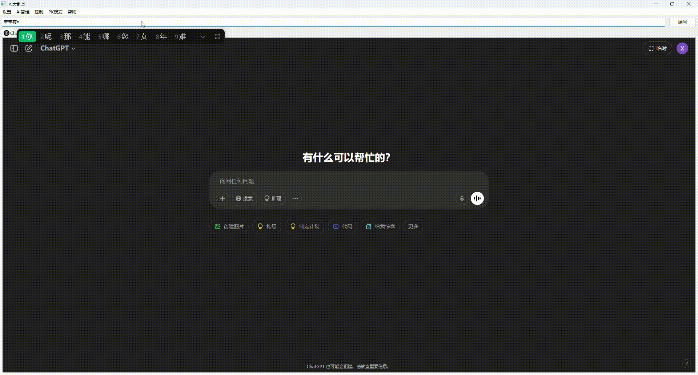
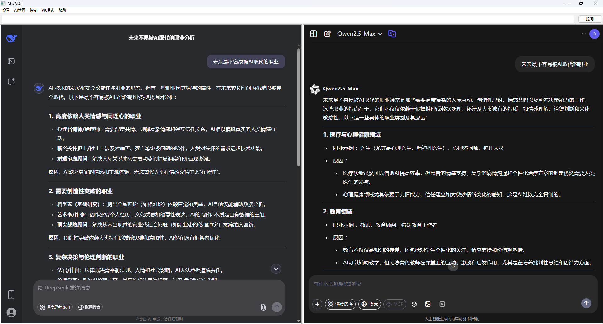

# AI大乱斗

AI大乱斗 是一个高效便捷的工具，旨在同时打开多个不同的 AI 网站，并一键发送相同文本消息到各个 AI 标签页，从而快速比较它们的回答。无论你是开发者、研究人员，还是对 AI 技术感兴趣的用户，AI大乱斗 都能帮助你节省大量来回切换各个网站的时间。

## 功能特点

- **多标签页同时操作**  
  一次性在多个 AI 平台上发送相同的文本信息，省去了重复输入和切换窗口的麻烦。
  

- **快速对比回答**  
  同步接收各个 AI 的回复，方便用户对比不同 AI 之间的回答质量和风格，助你快速找到最合适的解决方案。

- **PK 模式**  
  内置左右分屏功能，同时打开两个 AI 网站页面，实时比较它们的回答表现，让你一目了然哪一个 AI 表现更好。
  

- **支持多种 AI 平台**  
  目前支持的 AI 包括：  
  - ChatGPT  
  - DeepSeek  
  - Gemini  
  - Grok  
  - perplexity  
  - 千问  
  - 火山  
  - 文心一言

## 安装与使用

1. **下载与安装**  
   克隆或下载本仓库，使用VC2022进行编译。

2. **启动工具**  
   运行软件后，将自动打开多个标签页，每个标签页对应一个支持的 AI 平台。
   注意：第一次运行需要自行登录各个 AI 平台。

3. **发送消息**  
   在输入框中输入你的文本信息，点击发送，系统会自动将同一条消息发送到所有打开的 AI 标签页。

4. **PK 模式切换**  
   切换至 PK 模式，软件会启动左右分屏功能，仅同时展示两个 AI 平台的页面，方便你进行深入对比。

## 使用场景

- **快速验证**：同时获取多个 AI 的答案，快速验证信息的准确性。
- **功能对比**：比较不同 AI 的回复风格和处理能力，找到最适合的工具。
- **效率提升**：节省来回切换不同网站的时间，提高工作和研究效率。

## 许可证

本项目遵循 MIT 许可证。

---

通过 AI大乱斗，你可以更高效地探索和利用各大 AI 平台的能力，让你的工作和研究事半功倍。立即体验多 AI 同步操作带来的全新体验！
